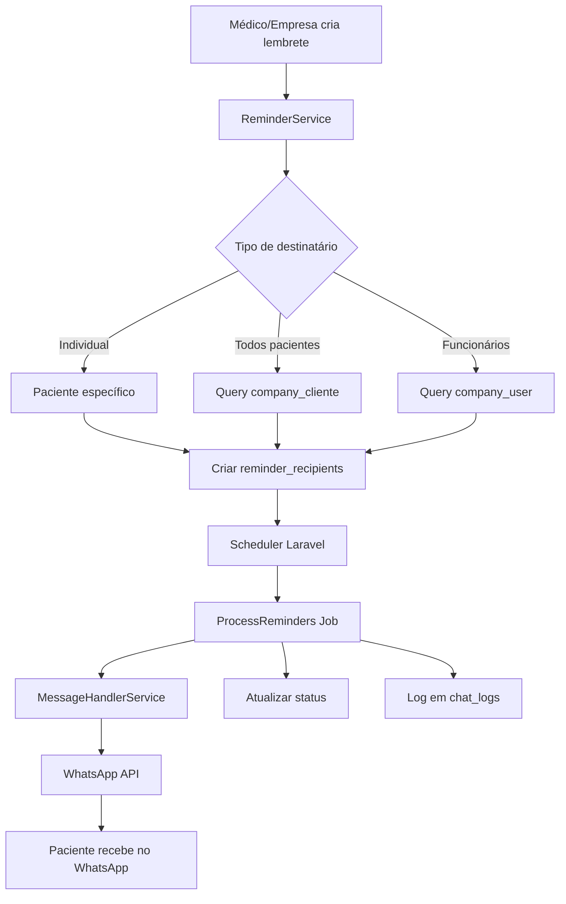

# 📅 Plano de Implementação - Sistema de Lembretes via WhatsApp

## 🎯 Visão Geral

Sistema de lembretes integrado ao ecossistema Karin, utilizando **exclusivamente WhatsApp** como canal de notificação, aproveitando a infraestrutura existente de `MessageHandlerService` e respeitando a arquitetura de roles/empresas já implementada.

## 🏗️ Arquitetura Revisada

### 1️⃣ **Estrutura de Banco de Dados**

```php
// database/migrations/2025_06_20_000001_create_reminders_table.php
Schema::create('reminders', function (Blueprint $table) {
    $table->id();
    
    // Criador do lembrete (médico, empresa, admin)
    $table->foreignId('created_by')->constrained('users');
    
    // Empresa associada (para lembretes corporativos)
    $table->foreignId('company_id')->nullable()->constrained('users');
    
    // Dados do lembrete
    $table->string('title');
    $table->text('message'); // Mensagem formatada para WhatsApp
    $table->enum('type', ['appointment', 'medication', 'exam', 'return', 'billing', 'general'])
          ->default('general');
    $table->enum('priority', ['low', 'normal', 'high', 'urgent'])->default('normal');
    
    // Agendamento
    $table->timestampTz('remind_at');
    $table->json('recurrence')->nullable(); // {"type": "daily|weekly|monthly", "interval": 1, "end_date": null}
    
    // Controle
    $table->boolean('is_active')->default(true);
    $table->timestamps();
    $table->softDeletes();
    
    // Índices para performance
    $table->index(['remind_at', 'is_active']);
    $table->index(['company_id', 'type']);
    $table->index('created_by');
});
```

```php
// database/migrations/2025_06_20_000002_create_reminder_recipients_table.php
Schema::create('reminder_recipients', function (Blueprint $table) {
    $table->id();
    $table->foreignId('reminder_id')->constrained()->cascadeOnDelete();
    $table->foreignId('user_id')->constrained()->cascadeOnDelete();
    
    // Status do envio
    $table->timestamp('sent_at')->nullable();
    $table->boolean('delivered')->default(false);
    $table->text('error_message')->nullable();
    
    // Rastreamento
    $table->timestamp('read_at')->nullable(); // Se integrar com WhatsApp Business API
    $table->timestamps();
    
    $table->unique(['reminder_id', 'user_id']);
    $table->index(['sent_at', 'delivered']);
});
```

### 2️⃣ **Models Aderentes ao Projeto**

```php
// app/Models/Reminder.php
namespace App\Models;

use App\Models\Traits\CacheTag;
use Illuminate\Database\Eloquent\Model;
use Illuminate\Database\Eloquent\Relations\BelongsTo;
use Illuminate\Database\Eloquent\Relations\BelongsToMany;
use Illuminate\Database\Eloquent\SoftDeletes;

class Reminder extends Model
{
    use SoftDeletes, CacheTag;
    
    protected $fillable = [
        'created_by', 'company_id', 'title', 'message',
        'type', 'priority', 'remind_at', 'recurrence', 'is_active'
    ];
    
    protected $casts = [
        'remind_at' => 'datetime',
        'recurrence' => 'array',
        'is_active' => 'boolean',
    ];
    
    // Relacionamentos seguindo padrão do projeto
    public function creator(): BelongsTo
    {
        return $this->belongsTo(User::class, 'created_by');
    }
    
    public function company(): BelongsTo
    {
        return $this->belongsTo(User::class, 'company_id');
    }
    
    public function recipients(): BelongsToMany
    {
        return $this->belongsToMany(User::class, 'reminder_recipients')
                    ->withPivot(['sent_at', 'delivered', 'error_message', 'read_at'])
                    ->withTimestamps();
    }
    
    // Scopes úteis
    public function scopeDue($query)
    {
        return $query->where('remind_at', '<=', now())
                     ->where('is_active', true);
    }
    
    public function scopeByCompany($query, $companyId)
    {
        return $query->where('company_id', $companyId);
    }
}
```

### 3️⃣ **Service Layer - Integração com WhatsApp**

```php
// app/Services/ReminderService.php
namespace App\Services;

use App\Models\Reminder;
use App\Models\User;
use App\Services\Integration\WhatsApp\MessageHandlerService;
use Illuminate\Support\Collection;
use Illuminate\Support\Facades\DB;
use Illuminate\Support\Facades\Log;

class ReminderService
{
    protected MessageHandlerService $whatsappService;
    
    public function __construct(MessageHandlerService $whatsappService)
    {
        $this->whatsappService = $whatsappService;
    }
    
    /**
     * Cria um lembrete respeitando a estrutura de empresas/funcionários
     */
    public function createReminder(array $data, User $creator): Reminder
    {
        return DB::transaction(function () use ($data, $creator) {
            // Cria o lembrete
            $reminder = Reminder::create([
                'created_by' => $creator->id,
                'company_id' => $data['company_id'] ?? $creator->id, // Se for empresa
                'title' => $data['title'],
                'message' => $this->formatMessageForWhatsApp($data['message']),
                'type' => $data['type'] ?? 'general',
                'priority' => $data['priority'] ?? 'normal',
                'remind_at' => $data['remind_at'],
                'recurrence' => $data['recurrence'] ?? null,
                'is_active' => true,
            ]);
            
            // Define destinatários
            $recipients = $this->resolveRecipients($data, $creator);
            $reminder->recipients()->attach($recipients);
            
            return $reminder;
        });
    }
    
    /**
     * Resolve destinatários baseado no contexto
     */
    protected function resolveRecipients(array $data, User $creator): Collection
    {
        // Lembrete individual
        if (!empty($data['recipient_ids'])) {
            return User::whereIn('id', $data['recipient_ids'])
                       ->whereNotNull('phone')
                       ->get()
                       ->pluck('id');
        }
        
        // Lembrete corporativo - todos os pacientes da empresa
        if (!empty($data['send_to_all_patients'])) {
            $companyId = $data['company_id'] ?? $creator->id;
            
            return User::whereHas('clientCompanies', function ($q) use ($companyId) {
                $q->where('company_id', $companyId);
            })
            ->whereNotNull('phone')
            ->where('status', true)
            ->get()
            ->pluck('id');
        }
        
        // Lembrete para funcionários
        if (!empty($data['send_to_employees'])) {
            $companyId = $data['company_id'] ?? $creator->id;
            
            return User::whereHas('employeeCompanies', function ($q) use ($companyId) {
                $q->where('company_id', $companyId);
            })
            ->whereNotNull('phone')
            ->where('status', true)
            ->get()
            ->pluck('id');
        }
        
        return collect();
    }
    
    /**
     * Envia lembretes pendentes via WhatsApp
     */
    public function sendPendingReminders(): void
    {
        $reminders = Reminder::due()
            ->with(['recipients' => function ($q) {
                $q->wherePivot('sent_at', null);
            }])
            ->get();
        
        foreach ($reminders as $reminder) {
            $this->sendReminder($reminder);
            $this->handleRecurrence($reminder);
        }
    }
    
    /**
     * Envia um lembrete específico
     */
    protected function sendReminder(Reminder $reminder): void
    {
        foreach ($reminder->recipients as $recipient) {
            try {
                // Usa o serviço existente de WhatsApp
                $sent = $this->whatsappService->sendMessage(
                    $recipient->phone,
                    $reminder->message,
                    $reminder->company_id ?? $reminder->created_by
                );
                
                // Atualiza status
                $reminder->recipients()->updateExistingPivot($recipient->id, [
                    'sent_at' => now(),
                    'delivered' => $sent,
                    'error_message' => $sent ? null : 'Falha no envio'
                ]);
                
                // Log no ChatLog para histórico
                $this->logInChatHistory($reminder, $recipient, $sent);
                
            } catch (\Exception $e) {
                Log::error('Erro ao enviar lembrete', [
                    'reminder_id' => $reminder->id,
                    'recipient_id' => $recipient->id,
                    'error' => $e->getMessage()
                ]);
                
                $reminder->recipients()->updateExistingPivot($recipient->id, [
                    'error_message' => $e->getMessage()
                ]);
            }
        }
    }
    
    /**
     * Formata mensagem para WhatsApp
     */
    protected function formatMessageForWhatsApp(string $message): string
    {
        // Adiciona emojis baseado no tipo/prioridade
        $message = str_replace(
            ['[urgente]', '[importante]', '[lembrete]'],
            ['🚨 *URGENTE*', '⚠️ *IMPORTANTE*', '📌 *LEMBRETE*'],
            $message
        );
        
        return $message;
    }
}
```

### 4️⃣ **Jobs & Commands**

```php
// app/Jobs/ProcessReminders.php
namespace App\Jobs;

use App\Services\ReminderService;
use Illuminate\Bus\Queueable;
use Illuminate\Contracts\Queue\ShouldQueue;
use Illuminate\Foundation\Bus\Dispatchable;
use Illuminate\Queue\InteractsWithQueue;
use Illuminate\Queue\SerializesModels;

class ProcessReminders implements ShouldQueue
{
    use Dispatchable, InteractsWithQueue, Queueable, SerializesModels;
    
    public function handle(ReminderService $reminderService): void
    {
        $reminderService->sendPendingReminders();
    }
}
```

### 5️⃣ **API REST - Seguindo Padrão do Projeto**

```php
// app/Http/Controllers/Api/ReminderController.php
namespace App\Http\Controllers\Api;

use App\Http\Controllers\Controller;
use App\Http\Requests\StoreReminderRequest;
use App\Http\Resources\ReminderResource;
use App\Services\ReminderService;
use Illuminate\Http\Request;

class ReminderController extends Controller
{
    protected ReminderService $reminderService;
    
    public function __construct(ReminderService $reminderService)
    {
        $this->reminderService = $reminderService;
    }
    
    public function index(Request $request)
    {
        $user = $request->user();
        
        // Se for empresa, mostra lembretes da empresa
        if ($user->hasRole('clinic') || $user->hasRole('doctor')) {
            $reminders = Reminder::where('company_id', $user->id)
                ->orWhere('created_by', $user->id)
                ->with(['creator', 'recipients'])
                ->paginate();
        } else {
            // Paciente vê apenas seus lembretes
            $reminders = $user->reminders()->paginate();
        }
        
        return ReminderResource::collection($reminders);
    }
    
    public function store(StoreReminderRequest $request)
    {
        $reminder = $this->reminderService->createReminder(
            $request->validated(),
            $request->user()
        );
        
        return new ReminderResource($reminder);
    }
}
```

### 6️⃣ **Integração com Scheduler**

```php
// app/Console/Kernel.php
protected function schedule(Schedule $schedule): void
{
    // Processa lembretes a cada minuto
    $schedule->job(new ProcessReminders)
        ->everyMinute()
        ->withoutOverlapping()
        ->onOneServer();
}
```

## 📊 Fluxo de Dados



## 🔑 Vantagens da Abordagem

1. **Reutilização Total**: Usa `MessageHandlerService` existente
2. **Coerência**: Respeita estrutura de roles e relacionamentos
3. **Rastreabilidade**: Integra com `chat_logs` para histórico completo
4. **Performance**: Usa filas do Laravel para não bloquear
5. **Flexibilidade**: Suporta lembretes individuais e em massa
6. **Auditoria**: Soft deletes e logs completos

## 🚀 Próximos Passos para Implementação

1. **Fase 1**: Criar migrations e models
2. **Fase 2**: Implementar ReminderService
3. **Fase 3**: Criar API endpoints e validações
4. **Fase 4**: Configurar Job e Scheduler
5. **Fase 5**: Testes unitários e de integração
6. **Fase 6**: Interface no frontend (Vue/React)

## 📝 Observações Importantes

- Sistema 100% focado em WhatsApp (sem email/SMS)
- Respeita isolamento de dados entre empresas
- Compatível com usuários criados via WhatsApp
- Pronto para escalar com Redis/Horizon
- Mantém padrões SOLID já estabelecidos no projeto
